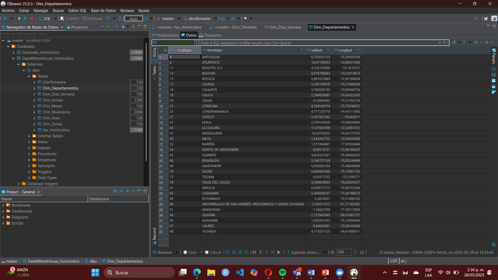
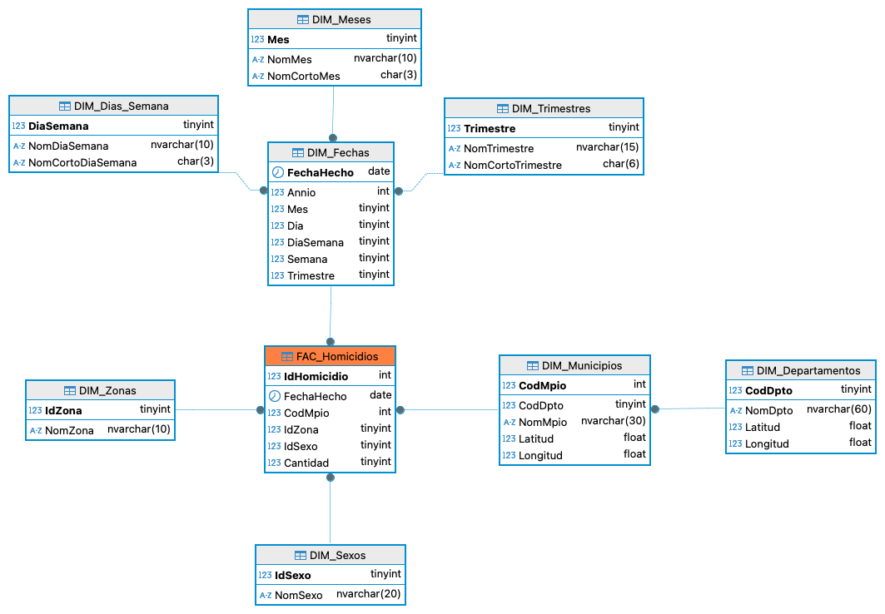

# Data Warehouse: 

Estructura centralizada para el analisis de homicidios en Colombia, basada en un modelo dimensional con tablas de hechos y dimensiones.

-- Scripts: Conjunto de instrucciones SQL que crean las tablas donde se almacenan los datos ya procesados desde el Data Lake.

-- Diseño DataWereHouse Homicidios en Colombia

-- Esquema del modelo Entidad-Relacion con enfoque en Copo de Nieve, que organiza las relaciones entre dimensiones y hechos del sistema analitico.

